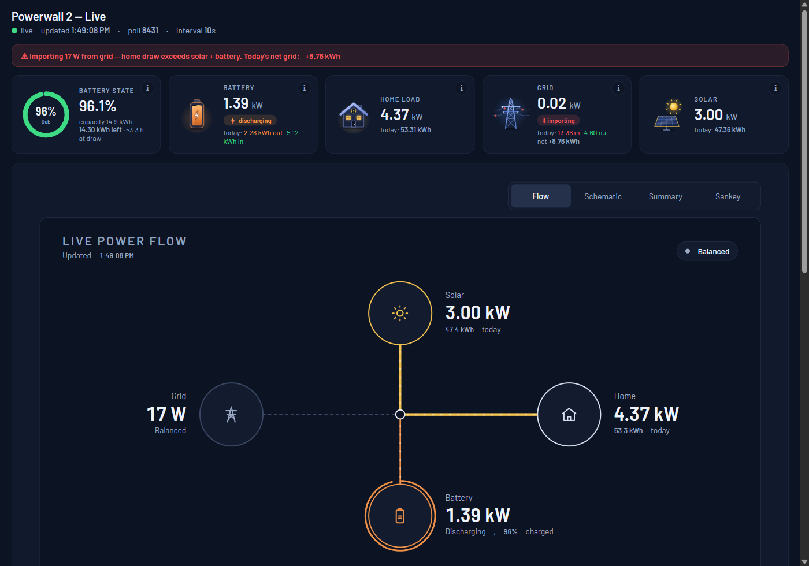

# Energy Dashboard

A local, self-hosted live dashboard for home solar + storage systems.
Polls your inverter/gateway every 10 seconds (burst-tested safe) and renders:

- **KPI cards** — solar, home, grid, battery (kW now + kWh today), SoE gauge
- **4-view power-flow widget** — Flow hub, Schematic, Summary, and a Sankey
  with animated power-flow particles
- **Grid-import verdict banner** (importing / exporting / balanced)
- **History charts** (SoE + grid power, 6h / 24h / 3d / 7d)
- **Energy summaries** with a rolling SQLite store (90 days raw + permanent
  monthly rollups)
- **Source switcher** — run Tesla *and* Enphase (or any future source) from
  the same dashboard, switching live from the header without restarting

Dark theme, responsive (mobile: zoom + swipe-to-pan, reflowed data rows),
click ⓘ tooltips, local API password option.

## Supported sources

| Source | What it talks to | Battery? |
|---|---|---|
| `tesla` (default) | Powerwall 2 gateway (`/api/...`, sticker-password login) | Yes |
| `enphase` | IQ Gateway, backbone API (`/auth/check_jwt` + `/production.json`) | Optional — the UI degrades to "no battery" when `soe_pct` is null |

A source is selected in `config.json` (`"source": "tesla"` / `"enphase"`)
or live from the header buttons. Each source implements the same
`poll_once() -> normalised snapshot` interface, so charts, cards and the
widget are source-agnostic.

Adding a new source = one module with `poll_once()` + a name in
`build_source()` in `app.py`. Nothing else changes.

## Enphase notes

- Auth: `GET /auth/check_jwt` with `Authorization: Bearer <token>` (a token
  from the Enphase portal's gateway credentials) issues a `sessionId` cookie;
  all subsequent API calls use **the cookie only** — the gateway resets
  connections that carry the Bearer token.
- The gateway rate-limits the token: the client authenticates only on 401,
  honours a 5-minute lockout after a rejected attempt, and **persists the
  session cookie** (`.ig_session`, gitignored) so restarts reuse the session
  instead of re-presenting the token.



> *Live dashboard — KPI cards (battery SoE, battery, home, grid, solar), the
> 4-view power-flow widget (Flow / Schematic / Summary / Sankey), history
> charts, rolling energy summaries, and a grid-import verdict banner. All data
> is polled from your gateway every 10 seconds. The header source switcher
> flips between Tesla and Enphase live.*

## Quick start

1. **Python 3.10+** (3.14 tested). Dependencies:

   ```
   pip install -r requirements.txt
   ```

   (Or use the bundled `start.bat`, which prefers a local `.venv` if present.)

2. **Launch:**

   ```
   start.bat            (Windows)
   python app.py        (anywhere)
   ```

   The server binds `127.0.0.1:8771` **by default** (localhost only). To make it
   reachable from your LAN, set `"bind_host": "0.0.0.0"` in `config.json`
   (HTTP Basic auth still applies — see *Security* below).

   On first run the app prints a **one-time UI password** to the console.
   Use `python app.py --set-ui-password` to choose your own (min 8 chars).

3. **Open the dashboard** — `http://<host>:8771`, log in with the UI
   username (`admin` by default) + the password, then use the settings page to
   enter:

   - `source` — `tesla` (default) or `enphase`
   - `gateway` — the gateway address (Tesla: `https://192.168.x.x`; Enphase
     IQ Gateway: `https://<iq-gateway-ip>`)
   - `email` — your Tesla app account email (optional; sent at login)
   - `local_api_password` — the gateway sticker password (Tesla only)
   - `enphase_token` — the IQ Gateway JWT (Enphase only)
   - tariff rates (`grid_import_rate`, `grid_export_credit`) — optional
   (Both secret fields are stored **Fernet-encrypted** on disk in
   `config.json` and are never exposed by the API.)

   No code changes are needed to point the app at a different gateway or
   switch credentials.

## Security

### Access control (web layer)

- **HTTP Basic auth is required** for every route except `/health`. The UI
  password is hashed (werkzeug/scrypt) — the plaintext is never stored or
  logged. First run prints a generated password to the console exactly once;
  set your own with `python app.py --set-ui-password` (min 8 characters).
- **Bind address** — the server binds `127.0.0.1:8771` by default
  (localhost only). Set `"bind_host": "0.0.0.0"` in `config.json` to listen
  on the LAN; auth still applies either way.
- **Host allowlist** — the `Host` header must be `localhost`, `127.0.0.1`,
  a LAN IP of this machine, or an entry in `allowed_hosts` (DNS-rebinding
  guard). Anything else gets a 400.
- **Per-IP throttle** — 10 failed logins from one IP lock it out for 5
  minutes (`Retry-After` header set).
- **CSRF guard** — state-changing POST routes (`/api/config`, `/api/reauth`)
  require the `X-Requested-With: powerwall-dashboard` header and a JSON
  body; anything else is rejected (403/400).
- **Security headers** — `Content-Security-Policy` (default `'self'`,
  per-request nonce for the inline scripts, Google Fonts only),
  `X-Content-Type-Options: nosniff`, `X-Frame-Options: DENY`,
  `Referrer-Policy: no-referrer`. Chart.js is served **locally**
  (`static/vendor/chart.umd.min.js`, SRI `sha384` verified).

### Secrets at rest

- `config.json` stores the local API password, the Enphase token and the UI
  password **Fernet-encrypted**.
- On Windows the Fernet key itself is **DPAPI-protected** and stored as
  `config.key.dpapi` (machine- and user-bound; a legacy plaintext
  `config.key` is migrated automatically and then deleted). On non-Windows
  systems the key falls back to plaintext `config.key` (and the app logs a
  warning). Both files and `config.json` are chmod 0600 where the platform
  allows, and are all gitignored.

### Gateway TLS — certificate pinning (TOFU)

- Every HTTPS call to a gateway is checked against a **SHA-256 pin of the
  gateway's certificate** (trust-on-first-use): the first successful
  handshake records the pin in `config.json`
  (`gateway_cert_sha256` / `enphase_cert_sha256`); every later handshake
  must match it or the connection is refused — **credentials are never
  sent to a mismatching certificate** (MITM / swap guard).
- **Resetting a pin** (e.g. after a legitimate gateway firmware/cert
  update): clear the relevant key in `config.json`
  (`""`) or change the gateway address — the pin is cleared automatically
  when the address changes, and the next successful handshake re-pins
  (TOFU).
- Changing a gateway address via the API/UI requires the matching secret in
  the *same* request, so a saved credential can't be silently pointed at a
  new host.

### Logging & inputs

- Log rotation (5 MB × 5 backups). No log line ever contains a password,
  token, cookie value or Authorization header (the Tesla client logs only
  the HTTP status and the *keys* of the login response, never its body).
- API inputs are validated and clamped (`/api/energy` `n` → 400 on
  invalid, clamped 1–3650; unknown periods 400; gateway URLs must be
  `https://` with a private/link-local IP — no SSRF).

### Do not port-forward 8771

Keep the dashboard on your LAN. It is built for trusted local networks,
not the public internet: if you must reach it remotely, use a VPN or an
authenticated tunnel in front of it — do not port-forward 8771.

## Storage

- SQLite (WAL mode) — raw 10-second snapshots kept for 90 days, then rolled up
  into permanent monthly aggregates.

## Configuration keys

| Key | Default | Secret? | Notes |
|---|---|---|---|
| `source` | `tesla` | No | `tesla` \| `enphase` — which adapter polls |
| `gateway` | `""` | No | Gateway base URL, `https://<ip>` (must be private/link-local) |
| `enphase_gateway` | `""` | No | Enphase IQ Gateway URL (falls back to `gateway`) |
| `username` | `customer` | No | Tesla login username |
| `email` | `""` | No | Tesla app account email (optional; never echoed by the API) |
| `local_api_password` | `""` | **Yes** | Tesla sticker password (Fernet-encrypted at rest) |
| `enphase_token` | `""` | **Yes** | IQ Gateway JWT (Fernet-encrypted at rest) |
| `poll_interval_seconds` | `10` | No | Poll cadence (burst-tested safe) |
| `grid_import_rate` | `0.0` | No | ZAR per kWh imported (cost calc) |
| `grid_export_credit` | `0.0` | No | ZAR per kWh exported (user: no credit) |
| `ui_username` | `admin` | No | HTTP Basic username for the dashboard |
| `ui_password_hash` | `""` | **Yes** | werkzeug hash (Fernet-encrypted at rest when set) |
| `bind_host` | `127.0.0.1` | No | `0.0.0.0` to listen on the LAN (auth still applies) |
| `allowed_hosts` | `[]` | No | Extra Host values to allow (merged with LAN IPs) |
| `gateway_cert_sha256` | `""` | No | Tesla TLS SHA-256 pin (TOFU on first connect) |
| `enphase_cert_sha256` | `""` | No | Enphase TLS SHA-256 pin (TOFU on first connect) |

Secrets are Fernet-encrypted in `config.json`; `GET /api/config` exposes only
`has_*` flags, never the values.

## Project layout

| File | Purpose |
|---|---|
| `app.py` | Flask app, REST API, scheduler, config UI, source factory, web auth gate |
| `config.py` | Config load/save — Fernet-encrypted secrets, DPAPI key protection, UI password hash |
| `powerwall.py` | Tesla gateway client + poller (requests-based, cert pinning) |
| `enphase.py` | Enphase IQ Gateway client + poller (JWT → session cookie, cert pinning) |
| `certpin.py` | TLS cert SHA-256 pinning (TOFU) — custom HTTPS adapter, credentials never sent to a mismatching cert |
| `storage.py` | SQLite persistence, retention, rollups (`source` column) |
| `templates/dashboard.html` | Dashboard UI (KPI cards, power-flow widget, charts) |
| `static/vendor/chart.umd.min.js` | Chart.js 4.4.3, served locally (SRI-verified) |
| `requirements.txt` | Pinned dependencies (incl. `pywin32` for DPAPI, `sys_platform == "win32"`) |
| `start.bat` | Windows launcher (uses `.venv` if present) |
